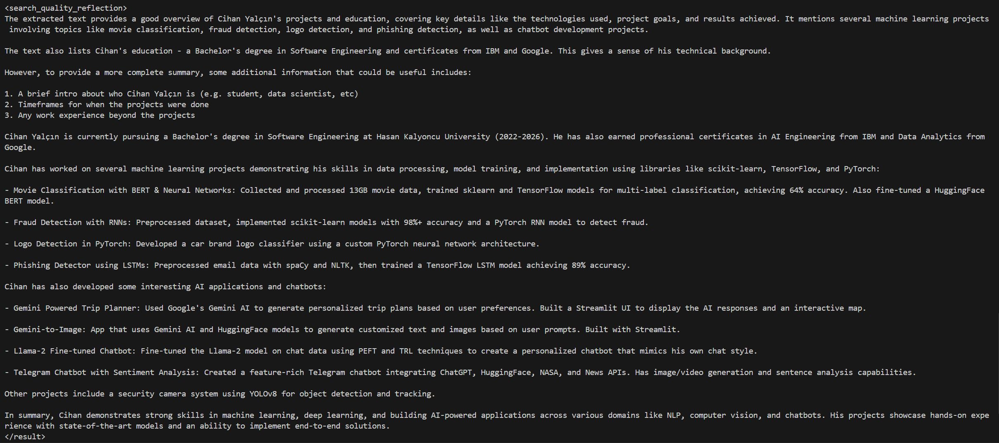
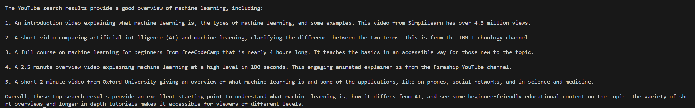

# Claude Powered Study Assistant

This is a Python-based study assistant powered by an LLM (Large Language Model). It provides various tools to assist with different tasks related to research, coding, note-taking, and more. Below is a description of each tool along with its capabilities and usage instructions.

## Tools Available
1. Wikipedia Search
    * **_Description_**: Searches Wikipedia based on user input. Useful for scientific or specific inquiries.
2. DuckDuckGo Search
    - **_Description_**: Utilizes DuckDuckGo's Search API to find information on the internet. Useful for general inquiries.
3. Note Saving
    - **_Description_**: Saves notes to 'notes.txt' for further user access.
4. Code Executer
    - **_Description_**: Executes the provided code string and compares the result to the expected output.
5. Calculator
    - **_Description_**: Basic arithmetic calculator supporting addition, subtraction, multiplication, and division.
6. YouTube Search
    - **_Description_**: Searches YouTube based on the given input and returns the most related 5 videos.
7. File Reading
    - **_Description_**: Extracts text from various file formats (PDF, TXT, DOCX).

## Usage
1. Import the `Tool` class from `Tool.py`.
2. Create instances of each tool with appropriate parameters.
3. Use the tools as needed by passing required parameters to their respective functions.

Example:
```python
from Tool import Tool

# Create tool instances
wiki = Tool(tool1_name, tool1_description, tool1_parameters)
search = Tool(tool2_name, tool2_description, tool2_parameters)
# Create more instances for other tools...
TOOLS = [wiki, search, ..]

# Use the tools
    names = [tool.name for tool in TOOLS]
    descriptions = [tool.description for tool in TOOLS]
    parameters = [tool.parameters for tool in TOOLS]
    all_tools = construct_format_tool_for_claude_prompt(names, descriptions, parameters)
    system_prompt = construct_tool_use_system_prompt([all_tools]))

function_calling_message = client.messages.create(
        model=MODEL_NAME,
        max_tokens=1024,
        messages=[message],
        system=system_prompt,
        stop_sequences=["\nHuman:", "\nAssistant", "</function_calls>"]
    ).content[0].text + '</function_calls>'
print(function_calling_message)
```

Example prompts and outputs:
```python
Prompt = "can you read 'Cihan Yalçın.pdf' and summarize it for me."
```


---

```python
Prompt = "search YouTube for Machine Learning"
```

